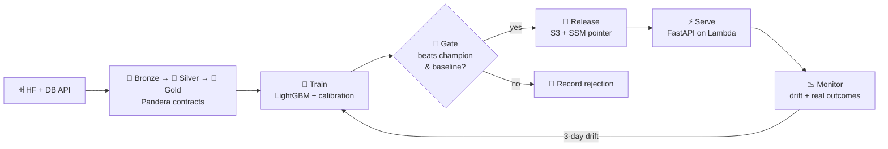

<div align="center">


<p>
  <a href="https://www.linkedin.com/in/md-piyal-ahmmed-bb1033205/"></a>
  <a href="mailto:piyalahmmed01@gmail.com"></a>
  
  
</p>

</div>

```python
class PiyalAhmmed:
    role       = "ML Engineer → MLOps"
    location   = "Schmalkalden, Germany 🇩🇪"
    education  = {
        "M.Sc.": "Applied Computer Science @ Hochschule Schmalkalden (ongoing)",
        "B.Sc.": "CSE @ Ahsanullah University of Science & Technology",
    }
    research   = "Mitigating Extrinsic Gender Bias for Bangla Classification — ACL 2026 Findings"
    shipped    = ["LLM + RAG systems in production", "FastAPI services", "vector search", "Dockerized ML"]
    building   = "Pünktlich — end-to-end MLOps on real Deutsche Bahn data"
    philosophy = "A model isn't done until it's versioned, monitored, and can be rolled back."
```

---

## 🚆 Currently building: `Pünktlich?`

> **Will my train leave on time?** Delay-risk predictions for German train departures, trained on ~226M historical stop events, fed by the live DB Timetables API every 15 minutes, monitored nightly against what actually happened, and retrained automatically when the world drifts. Runs on AWS serverless for **< $1/month**.



<details>
<summary><b>📋 Build log</b> (updated as I ship)</summary>

| Phase | Scope | Status |
|---|---|---|
| 0 | Repo, tooling, CI skeleton, pre-commit | 🔲 |
| 1 | Historical ETL → bronze/silver/gold + data contracts | 🔲 |
| 2 | Training pipeline, MLflow tracking, promotion gate | 🔲 |
| 3 | FastAPI serving on Lambda, release + rollback | 🔲 |
| 4 | Live ingestion, nightly ETL, drift monitoring | 🔲 |
| 5 | Continuous training loop, alerting | 🔲 |
| 6 | Terraform, CD with OIDC, React frontend, public Health page | 🔲 |

</details>

### MLOps skills this project covers

| Concept | How it's done here |
|---|---|
| **Data engineering** | Medallion layers, idempotent partition overwrites, schema contracts, quarantine on failure |
| **Orchestration** | Airflow 3 TaskFlow, dynamic task mapping, deferrable sensors |
| **Experiment tracking** | MLflow runs pinned to git SHA + data snapshot hash |
| **Model registry & gating** | `@champion` / `@challenger` aliases, metric + slice gate vs. baseline |
| **Serving** | FastAPI + Mangum on Lambda, container images, hot model swap without redeploy |
| **Monitoring** | Evidently data/prediction drift, daily Brier/AUC/calibration on real labels |
| **Continuous training** | Drift flag → Airflow sensor → retrain → gate → release |
| **CI/CD** | GitHub Actions, keyless AWS auth (OIDC), smoke tests, `terraform plan` on PRs |
| **Infrastructure as Code** | Terraform modules, remote state with locking |
| **Security** | Least-privilege IAM, SSM secrets, Trivy + gitleaks + pip-audit, no pickle, SHA-256 artifact manifests |
| **Cost engineering** | Serverless only, budget alarms, S3 lifecycle rules |

---

## 🛠️ Stack

**MLOps & Infra**
<br/>


**ML / DL / LLM**
<br/>


**Data & Backend**
<br/>


**Quality & Security**
<br/>


---

## 📌 Selected work

| Project | What's interesting about it | Stack |
|---|---|---|
| 🚆 [**Pünktlich?**](https://github.com/piyal21/puenktlich) | Closed-loop MLOps: gated releases, pointer-based rollback, drift-triggered retraining | Airflow · MLflow · Lambda · Terraform |
| 🔍 [**Document QA (RAG)**](https://github.com/piyal21/Gen-AI-Projects/tree/master) | Semantic retrieval over unstructured docs with embeddings + FAISS, LangChain chains, Streamlit UI | OpenAI · FAISS · LangChain |
| ✍️ [**LinkedIn Post Generator**](https://github.com/piyal21/Gen-AI-Projects/tree/master) | Prompt-engineered multi-variant generation with tone / length / audience controls | LLMs · Streamlit |
| 💳 [**Credit Card Fraud Detection**](https://github.com/piyal21/10MS_ML_Assessment) | Heavy class imbalance; LogReg / SVM / RF / KNN compared on precision-recall | scikit-learn |

### 📄 Research

**Mitigating Extrinsic Gender Bias for Bangla Classification Tasks** — *Findings of ACL 2026*
<br/>Joint-loss optimization to reduce gender bias in Bangla classifiers without sacrificing task accuracy.
<br/>[](https://arxiv.org/abs/2411.10636)

---

## 📊 Activity

<p align="center">
  
  
</p>

<p align="center">
  
</p>

<div align="center">
<sub><code>git commit -m "always be shipping"</code></sub>
</div>
